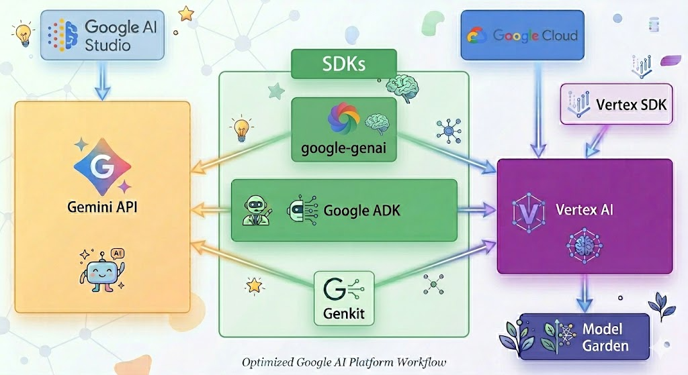

# Google Services by Topic

Last refreshed: 2026-04-14

## Models

- Frontier multimodal and reasoning models
  - [Gemini 3.1 Pro Preview](https://ai.google.dev/gemini-api/docs/models)
  - [Gemini 3 Flash Preview](https://ai.google.dev/gemini-api/docs/models)
  - [Gemini 3.1 Flash-Lite Preview](https://ai.google.dev/gemini-api/docs/models)
- Still current, but with announced retirement windows
  - [Gemini 2.5 Pro](https://ai.google.dev/gemini-api/docs/models) - scheduled for retirement on 2026-06-17
  - [Gemini 2.5 Flash](https://ai.google.dev/gemini-api/docs/models) - scheduled for retirement on 2026-06-17
  - [Gemini 2.5 Flash-Lite](https://ai.google.dev/gemini-api/docs/models) - scheduled for retirement on 2026-07-22
  - [Gemini 2.0 Flash](https://ai.google.dev/gemini-api/docs/deprecations) - scheduled for retirement on 2026-06-01
  - [Gemini 2.0 Flash-Lite](https://ai.google.dev/gemini-api/docs/deprecations) - scheduled for retirement on 2026-06-01
- Live and speech models
  - [Gemini 3.1 Flash Live Preview](https://ai.google.dev/gemini-api/docs/models)
  - [Gemini 2.5 Flash TTS Preview](https://ai.google.dev/gemini-api/docs/models)
  - [Gemini 2.5 Pro TTS Preview](https://ai.google.dev/gemini-api/docs/models)
- Image, video, and music generation
  - [Nano Banana](https://ai.google.dev/gemini-api/docs/models) (Gemini 2.5 Flash Image)

  - [Nano Banana 2 Preview](https://ai.google.dev/gemini-api/docs/models)
  - [Nano Banana Pro Preview](https://ai.google.dev/gemini-api/docs/models)
  - [Imagen 4](https://ai.google.dev/gemini-api/docs/models/imagen)
  - [Veo 3.1 Preview](https://ai.google.dev/gemini-api/docs/models)
  - [Veo 3.1 Lite Preview](https://ai.google.dev/gemini-api/docs/models)
  - [Lyria 3 Pro Preview](https://ai.google.dev/gemini-api/docs/models)
  - [Lyria 3 Clip Preview](https://ai.google.dev/gemini-api/docs/models)
  - [Lyria RealTime Experimental](https://ai.google.dev/gemini-api/docs/models)
- Specialized task and agent models
  - [Computer Use Preview](https://ai.google.dev/gemini-api/docs/models)
  - [Gemini Deep Research Preview](https://ai.google.dev/gemini-api/docs/models)
  - [Gemini Embedding](https://ai.google.dev/gemini-api/docs/embeddings)
  - [Gemini Embedding 2 Preview](https://ai.google.dev/gemini-api/docs/embeddings)
  - [Gemini Robotics Preview](https://ai.google.dev/gemini-api/docs/models)
- Open model families
  - [Gemma 4](https://developers.googleblog.com/bring-state-of-the-art-agentic-skills-to-the-edge-with-gemma-4/)
  - [Gemma 3n](https://ai.google.dev/gemma/docs/gemma-3n)
  - [Gemma 3](https://ai.google.dev/gemma/docs/core)
  - [Gemma 2](https://ai.google.dev/gemma/docs/model_card_2)
  - [CodeGemma](https://ai.google.dev/gemma/docs/codegemma)
  - [FunctionGemma](https://ai.google.dev/gemma/docs/functiongemma)
- Deprecated or shut down model notes
  - [Gemini 3 Pro Preview](https://ai.google.dev/gemini-api/docs/deprecations) - shut down on 2026-03-09
  - [Imagen 4 GA model IDs](https://ai.google.dev/gemini-api/docs/deprecations) - retirement window announced for 2026-06-24
  - [gemini-embedding-001](https://ai.google.dev/gemini-api/docs/deprecations) - retirement window announced for 2026-07-14

## End User Assistants

- [Gemini Apps](https://support.google.com/gemini/answer/13275745)

  - [Gemini Web App](https://gemini.google/about/)

  - [Gemini Mobile App](https://support.google.com/gemini/answer/14554984)

  - [Gemini in Chrome](https://www.google.com/chrome/ai-innovations/)

- [Gemini in Google Workspace](https://workspace.google.com/resources/ai/)

- [NotebookLM](https://notebooklm.google/)

## Dev Tools & Coding Agents

- [Gemini Code Assist](https://developers.google.com/gemini-code-assist/docs/overview)

- [Firebase Studio](https://firebase.google.com/docs/studio)

- [Gemini CLI](https://docs.cloud.google.com/gemini/docs/codeassist/gemini-cli)

- [Jules 2.0](https://jules.google/docs/) - current docs brand the product simply as Jules; treat it as experimental

- [Antigravity](https://antigravity.google/docs/get-started)

## Studios & Builders

- [Vertex AI](https://docs.cloud.google.com/vertex-ai/docs)
  - [Generative AI on Vertex AI Cookbook](https://docs.cloud.google.com/vertex-ai/generative-ai/docs/cookbook)

- [Google AI Studio](https://ai.google.dev/aistudio/)
  - [Google AI Studio quickstart](https://ai.google.dev/gemini-api/docs/ai-studio-quickstart)

- [Google AI Edge](https://ai.google.dev/edge)
  - [MediaPipe Tasks](https://ai.google.dev/edge/mediapipe/solutions/guide)
  - [LiteRT](https://ai.google.dev/edge/litert)

- [Stitch](https://stitch.withgoogle.com/)

- [Opal](https://opal.google/_app/landing/)

## APIs & SDKs

- [Gemini API](https://ai.google.dev/gemini-api/docs)
  - [Model catalog](https://ai.google.dev/gemini-api/docs/models)
  - [Deprecations](https://ai.google.dev/gemini-api/docs/deprecations)

- [Interactions API](https://ai.google.dev/api/interactions-api)

- [Batch API](https://ai.google.dev/gemini-api/docs/batch-api)

- [Function calling](https://ai.google.dev/gemini-api/docs/function-calling)

- [Structured outputs](https://ai.google.dev/gemini-api/docs/structured-output)

- [Context caching](https://ai.google.dev/gemini-api/docs/caching/)

- [Google Gen AI SDK](https://ai.google.dev/gemini-api/docs/libraries)

- [Gemini Live API](https://ai.google.dev/gemini-api/docs/live-api)

- [Gemini Embeddings](https://ai.google.dev/gemini-api/docs/embeddings)
- [Vertex AI](https://docs.cloud.google.com/vertex-ai/docs)

- [Agent Development Kit (Google ADK)](https://docs.cloud.google.com/agent-builder/agent-development-kit/overview)

- [Genkit](https://genkit.dev/docs/js/overview/)

- [Cloud Vision API](https://docs.cloud.google.com/vision/docs/request)

- [Cloud Speech-to-Text](https://docs.cloud.google.com/speech-to-text/docs/v1)

- [Cloud Natural Language API](https://docs.cloud.google.com/natural-language/docs)

- [Cloud Translation API](https://docs.cloud.google.com/translate/docs/translate-text)

- [MediaPipe](https://ai.google.dev/edge/mediapipe/solutions/guide)

- [LiteRT](https://ai.google.dev/edge/litert)

- [TensorFlow](https://www.tensorflow.org/api_docs)

- [JAX](https://docs.jax.dev/en/latest/jax-101.html#jax-101)

APIs participating in the diagram:

- [Gemini API](https://ai.google.dev/gemini-api/docs)
- [Interactions API](https://ai.google.dev/api/interactions-api)
- [Batch API](https://ai.google.dev/gemini-api/docs/batch-api)
- [Google Gen AI SDK](https://ai.google.dev/gemini-api/docs/libraries)
- [Gemini Live API](https://ai.google.dev/gemini-api/docs/live-api)
- [Vertex AI](https://docs.cloud.google.com/vertex-ai/docs)
- [Genkit](https://genkit.dev/docs/js/overview/)
- [Agent Development Kit](https://docs.cloud.google.com/agent-builder/agent-development-kit/overview)

## Data Grounding RAG Connectors

- [Google AI Studio](https://ai.google.dev/aistudio/)
- [Gemini API](https://ai.google.dev/gemini-api/docs)

  - [Google Search](https://ai.google.dev/gemini-api/docs/google-search)

  - [Grounding with Google Maps](https://ai.google.dev/gemini-api/docs/maps-grounding)

  - [URL Context](https://ai.google.dev/gemini-api/docs/url-context)

  - [File Search](https://ai.google.dev/gemini-api/docs/file-search)

- [Vertex AI Search](https://docs.cloud.google.com/vertex-ai/generative-ai/docs/learn/vertex-ai-search)

- [Vertex AI RAG Engine](https://docs.cloud.google.com/vertex-ai/generative-ai/docs/rag-engine/rag-overview)

## Document AI OCR

- [Document AI](https://docs.cloud.google.com/document-ai/docs/overview)

  - [Pretrained Parsers](https://docs.cloud.google.com/document-ai/docs/pretrained-overview)

  - [Summarizer](https://docs.cloud.google.com/document-ai/docs/custom-summarizer)

  - [Document AI Workbench](https://docs.cloud.google.com/document-ai/docs/training-overview)

  - [Enterprise Document OCR](https://docs.cloud.google.com/document-ai/docs/enterprise-document-ocr)

  - [Layout Parser](https://docs.cloud.google.com/document-ai/docs/layout-parse-chunk)

  - [Extraction](https://docs.cloud.google.com/document-ai/docs/extracting-overview)

  - [Classification](https://docs.cloud.google.com/document-ai/docs/custom-classifier)
- [Cloud Vision API](https://docs.cloud.google.com/vision/overview/docs)

  - [Vision OCR](https://docs.cloud.google.com/vision/docs/ocr)

## Fine-Tuning Customization

- [Vertex AI Tuning](https://docs.cloud.google.com/vertex-ai/generative-ai/docs/model-reference/tuning)
- Deprecated route notice

  - [Gemini API / Google AI Studio Tuning Notice (Deprecated)](https://ai.google.dev/gemini-api/docs/model-tuning)

## Evaluation & Observability

- [Gen AI Evaluation Service](https://docs.cloud.google.com/vertex-ai/generative-ai/docs/models/evaluation-overview)

- [Vertex AI Evaluation](https://docs.cloud.google.com/vertex-ai/docs/evaluation/introduction)

- [Agent Evaluation](https://docs.cloud.google.com/vertex-ai/generative-ai/docs/models/evaluation-agents)

- [Vertex AI Experiments](https://docs.cloud.google.com/vertex-ai/docs/experiments/intro-vertex-ai-experiments)

- [Vertex AI Model Monitoring](https://docs.cloud.google.com/vertex-ai/docs/model-monitoring/overview)

- [Vertex Explainable AI](https://docs.cloud.google.com/vertex-ai/docs/explainable-ai/overview)

- [Vertex AI Feature Store](https://docs.cloud.google.com/vertex-ai/docs/featurestore)

- [Cloud Trace](https://docs.cloud.google.com/trace/docs)

- [Cloud Profiler](https://docs.cloud.google.com/profiler/docs)

- [Cloud Logging](https://docs.cloud.google.com/logging/docs)

## Design to Code App Prototyping

- [Stitch](https://stitch.withgoogle.com/)
- [Google AI Studio](https://ai.google.dev/aistudio/)

  - [AI Studio Build Mode](https://ai.google.dev/gemini-api/docs/aistudio-build-mode)
- [Firebase Studio](https://firebase.google.com/docs/studio)

  - [App Prototyping agent](https://firebase.google.com/docs/studio/get-started-ai)
- [Opal](https://opal.google/_app/landing/)

## Guardrails Security Governance

- [Google AI Studio](https://ai.google.dev/aistudio/)

  - [Safety settings](https://ai.google.dev/gemini-api/docs/safety-settings)
- [Gemini API](https://ai.google.dev/gemini-api/docs)

- [Google Cloud Model Armor](https://docs.cloud.google.com/model-armor/overview)

- [Sensitive Data Protection](https://docs.cloud.google.com/sensitive-data-protection/docs/sensitive-data-protection-overview)

- [Vertex AI Agent Engine](https://docs.cloud.google.com/agent-builder/agent-engine/overview)

- [Security Command Center](https://docs.cloud.google.com/security-command-center/docs/security-command-center-overview)

  - [AI Protection](https://docs.cloud.google.com/security-command-center/docs/ai-protection-overview)

## Agents Workflow Orchestration

- [Vertex AI Agent Builder](https://docs.cloud.google.com/agent-builder/overview)
  - [Agent Development Kit](https://docs.cloud.google.com/agent-builder/agent-development-kit/overview)

  - [Agent Designer](https://docs.cloud.google.com/agent-builder/agent-designer)
  - [Vertex AI Agent Engine](https://docs.cloud.google.com/agent-builder/agent-engine/overview)

  - [Agent Garden](https://docs.cloud.google.com/agent-builder/overview)

  - [Agent Starter Pack](https://cloud.google.com/agent-builder/agent-engine/quickstart-adk)
- Agentic Gemini tool surfaces

  - [Computer Use](https://ai.google.dev/gemini-api/docs/computer-use)

  - [Gemini Deep Research](https://ai.google.dev/gemini-api/docs/deep-research)
  - [Function calling](https://ai.google.dev/gemini-api/docs/function-calling)
  - [Interactions API](https://ai.google.dev/api/interactions-api)

## Tech Enablement Deliverables

| Services Used | Tech Enablement Deliverable | Type |
| --- | --- | --- |
| [Vertex AI Agent Builder](#service-vertex-ai-agent-builder), [Google Search](#service-google-search), [Agent Development Kit](#service-agent-development-kit) | Fighting Desinformation Vertex Agent | Prototype |
| [File Search](#service-file-search), [Google Gen AI SDK](#service-google-gen-ai-sdk) | Gemini File Search | Prototype |
| [Google Gen AI SDK](#service-google-gen-ai-sdk) | 20260102_Google-Interactions-API | Report |
| [Antigravity](#service-antigravity) | 20260113_antigravity_review | Report |
| [Stitch](#service-stitch) | 20260115_ui-ux-generator | Report |
| Google Protocol | 20260116_Dynamic_Web_Building_with_A2UI | Report |
| [Stitch](#service-stitch) | 20260123_stitch_ai-studio_technical_evaluation | Report |
| [Agent Development Kit](#service-agent-development-kit) | 20260130_Building_GraphRAG_Agents_with_the_Google_ADK | Report |
| [Firebase Studio](#service-firebase-studio) | 20260130_firebase_and_firebase_studio | Report |
| Google Protocol | 20260217_WebMCP-Google | Report |
| [Vertex AI Agent Builder](#service-vertex-ai-agent-builder) | 20250414_VertexAIAgentBuilder | Report |
| Google Protocol | 20250506_A2A | Report |
| [Agent Development Kit](#service-agent-development-kit), [Google Gen AI SDK](#service-google-gen-ai-sdk), [Vertex AI Agent Builder](#service-vertex-ai-agent-builder) | 20250507_VertexAIAgents | Report |
| Google Protocol | 20250604_A2A_Security-Mitigations | Report |
| Google Protocol | 20250612_Workshop_A2A_MCP_part1 | Report |
| Google Protocol | 20250624_Workshop_A2A_MCP_part2 | Report |
| [Nano Banana](#service-nano-banana) | 20250828_Google Nano Banana Model | Report |
| [Antigravity](#service-antigravity) | 20251216_IntroToAntigravity | Report |
